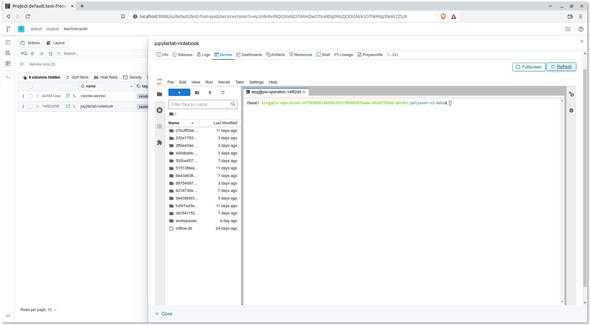
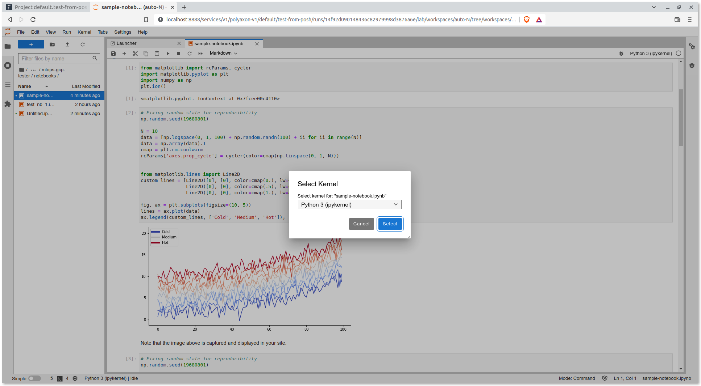

# Virtual Environment

While the Docker images you will be using to run experiments on Polyaxon
would contain the `conda` environments you would need, you can
also create
these virtual environments within your development environment, and have
it be persisted. The following set of commands allows you to create the
`conda` environment and store the packages within your own workspace
directory:

=== "Polyaxon VSCode Terminal"

    ```bash
    $ /miniconda3/bin/conda init bash
    $ source ~/.bashrc
    (base) $ conda env create -f aiap-mlops-conda-env.yml \
               -p /polyaxon-v1-data/workspaces/<YOUR_NAME>/conda_envs/aiap-mlops-conda-env
    (base) $ alias aiap-mlops-conda-env="conda activate /polyaxon-v1-data/workspaces/<YOUR_NAME>/conda_envs/aiap-mlops      -conda-env"
    (base) $ aiap-mlops-conda-env
    (aiap-mlops-conda-env) $ # conda environment has been activated
    ```

!!! tip
    If you encounter issues in trying to install Python libraries,
    do ensure that the amount of resources allocated to the VSCode
    service is sufficient. Installation of libraries from PyPI tends
    to fail when there's insufficient memory. For starters, dedicate
    4GB of memory to the service:

    ```yaml
    ...
        resources:
      requests:
        memory: "4Gi"
        cpu: "2.5"
      limits:
        memory: "4Gi"
        cpu: "2.5"
    ...
    ```

    Another way is to add the flag `--no-cache-dir` for your
    `pip install` executions. However, there's no similar flag for
    `conda` at the moment so the above is a blanket solution.

__Reference(s):__

- [`conda` Docs - Managing environments](https://docs.conda.io/projects/conda/en/latest/user-guide/tasks/manage-environments.html#creating-an-environment-from-an-environment-yml-file)
- [StackOverflow - "Pip install killed - out of memory - how to get around it?"](https://stackoverflow.com/questions/57058641/pip-install-killed-out-of-memory-how-to-get-around-it)

## Jupyter Kernel for VSCode

While it is possible for VSCode to make use of different virtual Python
environments, some other additional steps are required for Polyaxon
VSCode service to detect the `conda` environments that you would have
created.

1. Install the VSCode extensions
   [`ms-python.python`](https://marketplace.visualstudio.com/items?itemName=ms-python.python)
   and
   [`ms-toolsai.jupyter`](https://marketplace.visualstudio.com/items?itemName=ms-toolsai.jupyter)
   . After installation of these extensions, restart VSCode by using
   the shortcut `Ctrl + P`, entering `Developer: Reload Window` in the
   prompt and pressing `Enter` following that.
2. Ensure that you have
   [`ipykernel`](https://ipython.readthedocs.io/en/stable/install/kernel_install.html)
   installed in the `conda` environment that you intend to use.
   This template by default lists the library as a dependency under
   `aiap-mlops-conda-env.yml`.
3. Now enter `Ctrl + P` again and execute `Python: Select Interpreter`.
   Provide the path to the Python executable within the `conda`
   environment that you intend to use, something like so:
   `path/to/conda_env/bin/python`.
4. Open up any Jupyter notebook and click on the button that says
   `Select Kernel` on the top right hand corner. You will be presented
   with a selection of Python interpreters. Select the one that
   corresponds to the environment you intend to use.

## Jupyter Kernel for JupyterLab

The same with the VSCode service, the JupyterLab service
would not by default detect `conda` environments. You would have to
specify to the JupyterLab installation the `ipython` kernel existing
within your `conda` environment.

1. Ensure that you have
   [`ipykernel`](https://ipython.readthedocs.io/en/stable/install/kernel_install.html)
   installed in the `conda` environment that you intend to use.
   This template by default lists the library as a dependency under
   `aiap-mlops-conda-env.yml`.
2. Open up a
   [terminal within JupyterLab](https://jupyterlab.readthedocs.io/en/stable/user/terminal.html)
   .
3. Activate the `conda` environment in question and run the following
   ```bash
   $ ipython kernel install --name "name_of_environment" --user
   ```
4. Refresh the JupyterLab instance.
   
5. Within each Jupyter notebook, you can select the kernel of
   specific `conda` environments that you intend to use by heading to
   the toolbar under
   `Kernel` -> `Change Kernel...`.
  